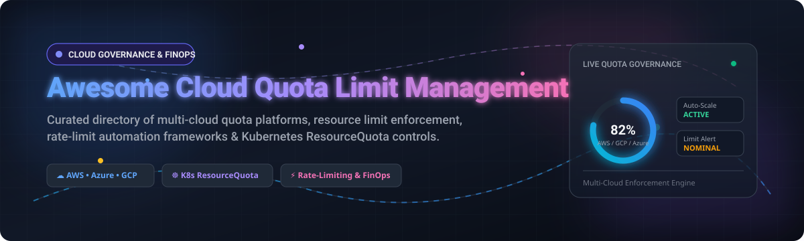

# Awesome-Cloud-Quota-Limit-Management

# Awesome-Cloud-Quota-Limit-Management 📊 ⚙️



  





  
  
  
  
  
  



---

## 🌟 Top Cloud Quota & Limit Management Ecosystem

**Curated List of Commercial Quota Platforms & Open-Source Limit Enforcement Tools**  
*Focused on Service Quota Monitoring, Resource Quota Enforcement, Automated Increase Requests, Multi-Account Governance & Self-Hosted Limit Management*

**Last updated: October 2026** 📅

---

### 📌 Overview & SEO Summary
Welcome to the ultimate curated directory of **cloud quota and limit management platforms**, **open-source resource governance tools**, and **service limit automation frameworks**. Whether you are looking for enterprise-grade commercial solutions (such as *AWS Service Quotas*, *Turbot Guardrails*, and *CloudHealth*), or self-hostable open-source alternatives (like *QuotaGuard*, *MLBatch*, and *Kyverno Schedule-Based Quotas*), this list covers category leaders, automated increase workflows, and privacy-respecting quota governance.

---

## 📑 Table of Contents
- [🏢 SaaS & Commercial Platforms](#-saas--commercial-platforms)
- [🔓 Open-Source GitHub Projects](#-open-source-github-projects)
- [🛠️ How to Contribute](#%EF%B8%8F-how-to-contribute)
- [📊 Star History](#-star-history)
- [🤝 Support & Sponsorship](#-support--sponsorship)
- [⚠️ Disclaimer](#%EF%B8%8F-disclaimer)

---

## 🏢 SaaS / Commercial Platforms

The cloud quota and limit management market spans **hyperscaler native tools** (AWS Service Quotas, Azure Quotas, Google Cloud Quotas) that provide **baseline quota visibility and increase requests**, and **specialized governance platforms** (Turbot, CloudHealth, Spot) that offer **automated monitoring, alerting, and multi-account enforcement**. **AWS Service Quotas** is **free** and provides programmatic access to view and request quota increases via API . **Azure Quotas** supports **programmatic quota management** through the `az quota` CLI extension, though **some providers like Cosmos DB are not supported** and require Resource Graph queries instead . **Google Cloud Quotas** uses the **Cloud Quotas API** (`cloudquotas.googleapis.com`) for programmatic list and update operations, with **IAM roles** `roles/cloudquotas.viewer` and `roles/cloudquotas.admin` required for access .

| SaaS / Commercial Platform | Company / Owner | Valuation / Market Cap | Standard Edition Starting Price | Free Tier / Free Trial Limits | Description |
| :--- | :--- | :--- | :--- | :--- | :--- |
| **[AWS Service Quotas](https://aws.amazon.com/service-quotas/)** ☁️ | Amazon | ~$2.0 Trillion | **Free service** | **Free forever** | **AWS-native quota management** — **Programmatic access** via `service-quotas` API for viewing and requesting increases . **Quota history tracking** with `list-requested-service-quota-change-history`. **Typical approval: 1-3 business days** for standard requests . |
| **[Azure Resource Quotas](https://azure.microsoft.com/en-us/products/azure-quotas/)** 🔷 | Microsoft | ~$3.90 Trillion | **Free service** | **Free forever** | **Azure-native quota management** — **`az quota` CLI extension** for programmatic list, show, usage, and update operations . **Cosmos DB not supported** — use Resource Graph + documentation. **StandardCore metric requires Microsoft contact** for limit increase . |
| **[Google Cloud Quotas](https://cloud.google.com/quotas)** 🌐 | Google (Alphabet) | ~$2.0 Trillion | **Free service** | **Free forever** | **GCP-native quota management** — **Cloud Quotas API** for programmatic list and update . **QuotaPreference** supports preferred value upserts with `validateOnly` for dry runs. **Gemini API quotas** managed via `gemini-quota-manager.py` . |
| **[Turbot Guardrails](https://turbot.com/guardrails)** 🛡️ | Turbot | Private | **Custom enterprise pricing** | **2-week free trial** (SaaS) | **Preventive Security Posture Management (PSPM)** — **Prevention maturity scoring** (Level 0–5) against CIS and NIST benchmarks. **Policy Simulator** tests changes against real CloudTrail data. **Control packs** from $25K (SaaS) . |
| **[CloudHealth](https://www.cloudhealthtech.com/)** 🏥 | Broadcom (VMware) | ~$60 Billion | **Custom per-account pricing** | **No free tier** | **Multi-cloud cost governance** — **Rightsizing reports** with list price vs. cost history. **Tag-based pricing allocation** at $4–$5/day per tag value. **Manual remediation** — recommendations require human implementation . |
| **[CloudZero](https://www.cloudzero.com/)** 📊 | CloudZero | Private | **Custom pricing** (usage-based) | **No free tier** | **Unit economics platform** — **Hidden costs: Professional Services $5K–$15K, Support 15–25% uplift** . **Overage charges** apply if cloud spend exceeds contract . |
| **[Spot by NetApp (Flexera)](https://spot.io/)** 🟢 | NetApp / Flexera | ~$20 Billion | **$1.415/100 vCPU hours** (managed compute) | **Free tier: up to 20 VMs** | **Cloud automation and optimization** — **Savings dimensions bill at $0.001, $0.15, and $0.28 per unit** — the fee climbs as the tool succeeds . |
| **[Vantage](https://www.vantage.sh/)** 💰 | Vantage | Private | **Free tier available**; Pro: **$30/month + 3% managed spend** | **Free: 2 accounts, 10 cost reports** | **Cloud cost transparency** — Multi-cloud visibility with **savings opportunities** via Compute Optimizer, Rightsizing, and RI recommendations . |
| **[Morpheus Data](https://morpheusdata.com/)** 🔮 | Morpheus Data | Private | **Quote-based, custom pricing** | **Demo available** | **Cloud management platform** — **Self-service provisioning with policy guardrails** . **Custom pricing engine** with USN currency support . |
| **[Apptio Cloudability](https://www.apptio.com/products/cloudability/)** 💰 | IBM (Apptio) | ~$200 Billion (IBM) | **$2,500/mo for $1M managed spend** | **Free tier: up to 3 cloud accounts** | **Percentage-of-spend FinOps** — **Overage fees: $1,930 (Essentials) to $4,410 (Premium) per unit** . **Allocates 100% of cloud costs** including containers, support, and shared services . |

---

## 🔓 Open-Source GitHub Projects

*Sorted by GitHub_Stars_Count (Descending)* 🌟

- **[QuotaGuard (AWS Quota Automation)](https://github.com/aws-solutions-library-samples/guidance-for-managing-aws-quotas-through-automation)**   
  **AWS guidance for automated quota monitoring and alerting across single or multiple accounts**, open-source. **Centralized EventBridge hub** receives quota-threshold events from all spoke accounts . **SNS notifications** include account ID, service name, region, and usage percentage. **Pre-configured quota list** covering EBS storage, EC2 VPN connections, transit gateway route tables, ELB instances, VPC network interfaces, S3 buckets, IAM managed policies, and NAT gateway private IPs . **Cost: $6.45/month per region per account** for processing 259,200 quota usage records . **The most complete open-source AWS quota monitoring solution** — production-ready with multi-account support. 📊

- **[MLBatch (CodeFlare)](https://github.com/project-codeflare/mlbatch)**   
  **Queuing and quota management for AI/ML batch jobs on Kubernetes**, open-source. **Enforces team quotas at namespace level** using Kueue, Kubeflow Training Operator, KubeRay, and Codeflare Operator . **Automates borrowing and reclamation of unused quotas across teams** — teams can use priorities within their namespaces without impacting others. **AppWrappers** for fault detection and automatic retry of failed pods. **Coscheduler** supports gang scheduling and minimizes GPU fragmentation . **The most sophisticated open-source quota management for AI/ML workloads** . 🤖

- **[Kyverno Schedule-Based Quotas](https://github.com/kyverno/policies/tree/main/cost-optimization/schedule-based-quotas)**   
  **Automatically adjusts resource quotas based on time schedules to optimize cloud costs**, open-source. **Reduces resource quotas during non-business hours** while ensuring essential services remain operational . **Business hours (9 AM–5 PM, Mon–Fri)**: CPU 20 cores, memory 40Gi. **Non-business hours**: CPU 10 cores, memory 20Gi. **Kyverno ClusterPolicy** with `background: true` for continuous enforcement . **The most elegant open-source cost-optimization quota pattern** — schedule-aware resource governance. ⏰

- **[proxmox-cloudportal](https://github.com/proxmox-cloudportal/cloud-platform)**   
  **Multi-tenant cloud management portal for Proxmox VE**, open-source. **Designed for 500+ users and 1000+ VMs** . **Per-organization quota limits** for **CPU cores (total vCPUs)**, **memory (GB RAM)**, **storage (GB disk)**, **VM count**, and **cluster count** . **Quotas enforced before resource creation and tracked in real-time** . **Superadmin** role manages clusters and updates quotas. **Complete isolation between organizations** via `X-Organization-ID` header . **The most production-ready open-source multi-tenant quota system** . 🏢

- **[gemini-quota-manager](https://github.com/nhsy/gemini-quota-manager)**   
  **Single-file Python script for managing Gemini API quotas on GCP**, open-source. **List and update Gemini-related quotas** via Cloud Quotas API . **Default safe behavior**: dry-run by default, explicit `--ack-decrease-risks` required for decreases . **Caps enabled paid-tier per-model daily quotas** to `--value` (default 1000) without raising lower quotas. **Disables legacy/experimental models** via policy rules (`gemini-omni`, `gemini-robotics`, `tool-retrieval`, `tts`, `exp`, `lite`, `live`) . **Rate-limit and retry** for large projects. **The most practical open-source GCP quota manager** . 🎯

- **[nssc (not so simple cloud)](https://github.com/nikita-popov/nssc)**   
  **Lightweight self-hosted cloud storage with per-user quota enforcement**, open-source. **Multiple file protocols** (REST, WebDAV, and more). **Private per-user directories** with configurable quota (e.g., `10GiB`, `512MiB`) . **Write operations subject to quota** — file creation and open-for-write rejected with `EPERM` if exceeding quota . **Simple CLI**: `nssc adduser ~/storage/ alice 10GiB` . **The simplest open-source per-user quota enforcement** for self-hosted storage. 💾

- **[AWS Bedrock Quota Dashboard](https://github.com/aws-samples/sample-quota-dashboard-for-amazon-bedrock)**   
  **Deployable CloudWatch dashboard for real-time Bedrock TPM/RPM quota usage**, open-source. **80+ pre-configured models** including Nova, Claude, Llama, Mistral, and Titan . **Dual quota monitoring** tracks both **token quotas (TPM)** and **request quotas (RPM)** . **Initial Reservation vs Actual Consumption** visualization shows throttling causes . **Auto-refresh every 2.9 hours** via EventBridge . **Application Inference Profile Aggregation** for shared quotas . **The most comprehensive open-source Bedrock quota dashboard** . 📈

- **[antigravity-dashboard](https://github.com/OmerFarukOruc/antigravity-dashboard)**   
  **AI-powered developer dashboard with real-time quota intelligence**, open-source. **Automatic account rotation** — selects accounts with highest quota . **Model-specific selection** routes Claude requests to Claude quota, Gemini to Gemini quota . **Rate limit handling** with automatic retry and exponential backoff on 429 errors . **WebSocket notifications** for real-time rate limit alerts . **API proxy** for Claude Code CLI and OpenAI-compatible clients . **The most developer-friendly open-source quota dashboard** . 🎛️

- **[GCP Quota Manager (Python Client)](https://github.com/googleapis/google-cloud-python/tree/main/packages/google-cloud-cloudquotas)**   
  **Official Google Cloud Quotas Python client**, Apache-2.0 licensed. **Programmatic access to Cloud Quotas API** for listing and managing quota preferences . **`GetQuotaPreference`** for retrieving specific quota configurations. **Part of the google-cloud-python monorepo** with generated samples and full API coverage . **The official Python SDK for GCP quota automation** . 🐍

- **[Samsung Cloud Platform Terraform Provider (Quota Data Source)](https://github.com/SamsungSDSCloud/terraform-provider-samsungcloudplatformv2)**   
  **Terraform data source for Samsung Cloud Platform account quotas**, open-source. **Read-only access to account quota details** including account ID, quota item, initial value, applied value, and unit . **Supports Terraform infrastructure-as-code workflows** for quota visibility. **Part of the Samsung Cloud Platform v2 provider** . ☁️

---

## 🛠️ How to Contribute

Contributions are welcome! Follow these steps to submit new quota management platforms or open-source limit enforcement software:

1. 🍴 **Fork** the repository.
2. 📝 **Add/edit** entries in `README.md` maintaining table/list structure and formatting.
3. 🔗 Include project title, official website/GitHub link, exact Stars_Count, license, and brief description.
4. 🚀 Submit a **Pull Request** with a descriptive summary of your changes.

---

## 📊 Star History



---

## 🤝 Support & Sponsorship

If you find this cloud quota and limit management repository useful, please consider supporting the project:

- ⭐ **Star** this repository to increase visibility!
- 🔀 **Fork** and share with fellow cloud architects, SREs, and open-source advocates.
- ☕ **Sponsor & Buy Me a Coffee**: Support ongoing open-source curation via the [GitHub Sponsor Dashboard](https://github.com/sponsors/ishandutta2007).

---

## ⚠️ Disclaimer

- This is a **community-curated** list — not exhaustive and not an endorsement. ℹ️
- **AWS Service Quotas is free** and supports programmatic increase requests via API . **Typical approval: 1-3 business days** for standard requests. **EC2 quotas are per-region and per-instance-family** — a few large instances can exhaust the default 64 vCPU limit .
- **Azure Quotas does not support Cosmos DB** — use Resource Graph queries and documentation instead . **StandardCore metric requires contacting Microsoft directly** for limit increases .
- **Google Cloud Quotas requires two APIs enabled**: `cloudquotas.googleapis.com` and the service-specific API (e.g., `generativelanguage.googleapis.com` for Gemini) . **IAM roles required**: `roles/cloudquotas.viewer` for listing, `roles/cloudquotas.admin` for updates .
- **Open-source tools (QuotaGuard, MLBatch, Kyverno) are not turnkey** — **QuotaGuard requires EventBridge, Lambda, DynamoDB, and SNS deployment** ($6.45/month per account) . **MLBatch requires OpenShift/Kubernetes with Kueue, KubeRay, and Codeflare Operator** . **Always validate quota enforcement with a proof-of-concept** before production deployment. 📊

---



  <b>Made with ❤️ for cloud architects, SREs, and open-source quota management advocates.</b>

